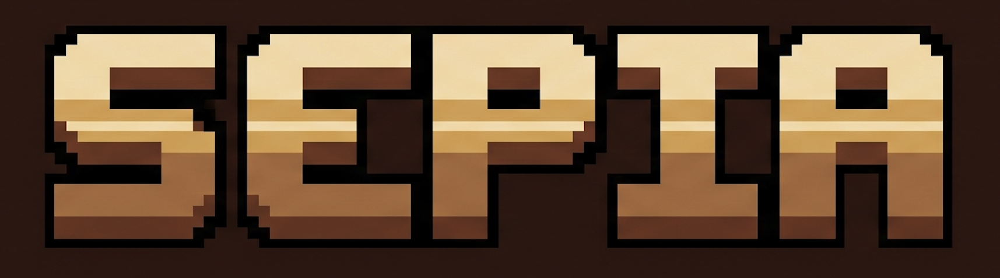

<p align="center">
  
</p>

<p align="center">
  <a href="https://github.com/rinaldofesta/sepia/actions/workflows/ci.yml"></a>
</p>

SEPIA is an inference engine that runs [Inkling](https://huggingface.co/thinkingmachines/Inkling) (Thinking Machines' 975B-parameter MoE, 41B active) on a Mac with 128GB of unified memory, by streaming experts from SSD. One model, one machine class, correctness proven before speed.

Current state: the engine reproduces Inkling's forward pass token-exactly against the transformers reference, on CPU, gated in CI on every push. P1 is done: it now generates real greedy tokens from the full 317GB weights, cross-checked against a llama.cpp build on the same GGUF (text-exact on both test prompts, id-exact on one). P2's Metal path and first honest tok/s number are done too: resident weights, banded attention, and MoE routing moved to Metal, with routed experts served from an LRU-streamed, mlocked GPU cache and async prefetch overlap. Real measured throughput: ~1.39-1.57 tok/s steady-state on both P1 prompts, cold and warm (down from P1's ~29-31s/token, i.e. ~0.6-0.7s/token now) — at the floor of the project's original 1.5-3 tok/s target, and the binding constraint is now GPU compute, not disk I/O (measured tok/s falls short of even the cold, 0%-hit pure-I/O ceiling). P2's routing-predictability experiment (PILOT) and phase close-out are still open. Full results: [docs/p2-perf.md](docs/p2-perf.md); P1's correctness baseline: [docs/p1-first-tokens.md](docs/p1-first-tokens.md).

## Why this exists

The smallest published Inkling quant ([Unsloth UD-IQ1_S](https://huggingface.co/unsloth/inkling-GGUF), ~270GB) needs roughly twice the memory of a 128GB Mac. llama.cpp's Inkling support is a draft PR ([#25731](https://github.com/ggml-org/llama.cpp/pull/25731)) with no MTP speculation, and the transformers reference has no MTP forward path either, even though the checkpoint ships 8 MTP layers built for lossless speculative decoding. The `reasoning_effort` dial is a chat-template mechanism no server exposes per request. Tinker fine-tunes are LoRA-based and have no local Apple Silicon story.

SEPIA's bet, inherited from [colibri](https://github.com/JustVugg/colibri): RAM stops being a hard cutoff when experts stream from disk. Inkling routes each token to 6 of 256 experts per layer plus 2 always-active shared experts. One routed expert averages ~18.5MB in the 2-bit quant ([measured](docs/gguf-inventory-ud-q2_k_xl.md)) and lives at a known offset: streaming it is one pread per tensor.

## Try it now (no downloads)

The tiny oracle fixtures are committed, so the correctness gate runs on a bare clone:

```
git clone https://github.com/rinaldofesta/sepia
cd sepia
make test
```

Expected output:

```
prefill 32/32
decode 20/20
```

That is `src/sepia.c` (single file, C11, no dependencies) implementing Inkling's full architecture: banded content-dependent relative position bias (no RoPE), short convolutions on K/V and residual branches, 55 sliding-window plus 11 global attention layers with per-type GQA, sigmoid router with selection-only bias, shared-expert sink. Every position matches a seeded transformers 5.14.1 reference; max logit difference 1.5e-8. Tested on macOS arm64 (CI runs it too); Linux is unverified.

Tools that run without the weights:

```
# inventory a remote GGUF from its headers alone (~40MB of Range reads against 317GB)
python3 tools/gguf_inspect.py --repo unsloth/inkling-GGUF \
  --file "UD-Q2_K_XL/inkling-UD-Q2_K_XL-00001-of-00008.gguf" --all-parts

# measure your SSD at expert-slab sizes
make iobench && ./iobench <big-file> 15 800 4 1

# regenerate the oracle (needs the torch venv, see tools/make_oracle.py)
.venv/bin/python tools/make_oracle.py
```

## Measured, not estimated

Numbers from this machine class (MacBook Pro M5 Max, 128GB), commands and full tables in the linked docs:

| quantity | value | source |
|---|---|---|
| SSD random reads, 15MB blocks, F_NOCACHE | 13.33 GB/s | [ssd-bench](docs/ssd-bench.md) |
| 3x5MB preads vs 1x15MB pread | 0.13% apart | [ssd-bench](docs/ssd-bench.md) |
| average expert slab (gate+up+down) | 18,498,816 B | [inventory](docs/gguf-inventory-ud-q2_k_xl.md) |
| cold decode read volume | ~7.1GB/token | 6 experts x 64 MoE layers |
| pure-I/O ceiling, 75% expert hit rate | ~7.5 tok/s | [DESIGN.md](docs/DESIGN.md) (bandwidth: [ssd-bench](docs/ssd-bench.md)) |
| pure-I/O ceiling, fully cold | ~1.9 tok/s | [DESIGN.md](docs/DESIGN.md) (bandwidth: [ssd-bench](docs/ssd-bench.md)) |
| P1 steady-state, scalar CPU path | ~29-31s/token | [p1-first-tokens](docs/p1-first-tokens.md) |
| P2 steady-state, Metal + GPU expert cache, cold | 1.386-1.456 tok/s | [p2-perf](docs/p2-perf.md) |
| P2 steady-state, Metal + GPU expert cache, warm | 1.427-1.573 tok/s | [p2-perf](docs/p2-perf.md) |
| P2 256-token plateau, cumulative expert-cache hit rate | ~82-84% | [p2-perf](docs/p2-perf.md) |
| P2 peak RSS (256-token run) | 64.31GB | [p2-perf](docs/p2-perf.md) |

The measurements have already overruled the plan twice. The repack died: a per-expert container copy was the design until the benchmark showed three small preads cost the same as one large one, so SEPIA streams experts straight from the GGUF through an [index sidecar](docs/container.md). And the target stayed honest: 1.5-3 tok/s for first real decode, under a ceiling that says I/O will not be the bottleneck.

## Roadmap

Phase 0 (done): oracle, token-exact CPU engine, SSD ground truth, GGUF inventory, container tooling. Everything above.

- P1 (done): 7 dequant types bit-exact vs gguf-py fixtures (CI-gated); C tokenizer exact vs HF tokenizers (mini 9/9, real 25/25, ~8300-string stress sweep, zero mismatches) and vs llama-tokenize (7/7); first real greedy tokens deterministic on both test prompts, cross-checked against the pinned llama.cpp draft-PR build (text-exact both prompts, id-exact on prompt 1); ~29-31s/token steady on the scalar CPU path, correctness-only. Full results: [docs/p1-first-tokens.md](docs/p1-first-tokens.md)
- P2 (Metal path + first tok/s number: done): resident weights, banded attention, and MoE routing on Metal; routed experts served from an LRU-streamed, mlocked GPU cache with async prefetch overlap; both P1 prompts still exact-sequence on GPU. Measured throughput ~1.39-1.57 tok/s steady-state (cold and warm) — at the floor of the 1.5-3 tok/s target, and now compute-bound rather than I/O-bound (falls short of even the cold pure-I/O ceiling despite good cache hit rates). Full results: [docs/p2-perf.md](docs/p2-perf.md). Routing-predictability experiment (PILOT) and phase close-out still open.
- P3: learning cache: routing history persisted across sessions, confidence-ramped auto-pin, prefetch if P2 says yes
- P4: MTP speculation from the dedicated 10.5GB `mtp.safetensors` shard, quantized in-house at 8-bit or better
- P5: OpenAI + Anthropic compatible server, per-request effort dial, agent integrations
- P6: own imatrix quantizer, NLL validation against hosted-API continuations, published containers
- P7: runtime LoRA for Tinker checkpoints; Inkling-Small as a drop-in when its weights release

Full design with the reasoning behind each phase: [docs/DESIGN.md](docs/DESIGN.md).

## Docs

- [DESIGN.md](docs/DESIGN.md): the whole design, verified model facts, memory regime
- [architecture-notes.md](docs/architecture-notes.md): Inkling's forward pass specified to the formula level, cited to transformers source; the C engine was written from this doc alone
- [ssd-bench.md](docs/ssd-bench.md): the benchmark, including the macOS F_NOCACHE trap it caught
- [container.md](docs/container.md): GGUF-direct streaming layout, index sidecar, resident extraction
- [gguf-inventory-ud-q2_k_xl.md](docs/gguf-inventory-ud-q2_k_xl.md): all 1512 tensors of the weight source

## Known limits

- P2's Metal path reaches ~1.39-1.57 tok/s steady-state (down from P1's ~29-31s/token on the scalar CPU path, [docs/p1-first-tokens.md](docs/p1-first-tokens.md)), at the floor of the 1.5-3 tok/s target, not comfortably inside it; GPU compute, not disk I/O, is now the binding constraint ([docs/p2-perf.md](docs/p2-perf.md))
- Attention log-scaling past 128K positions is implemented per spec but untestable at oracle scale
- The 15MiB unaligned-read margin, once 93.9% under concurrent load, re-measured at ~101% on a quiet disk (2026-07-20); the margin concern is retired ([docs/container.md](docs/container.md))
- Multimodal input and MTP are out of scope until P4+; text in, text out

## Contributing

Read [AGENTS.md](AGENTS.md) first; it binds humans and AI agents equally. The two rules that matter most: the oracle is the gate (no forward-pass change merges without `./sepia` passing token-exact) and no C++ in the engine. Performance claims come with the command, the machine, and the numbers.

## Lineage and license

SEPIA fuses two projects, with attribution in [NOTICE](NOTICE): [ds4](https://github.com/antirez/ds4) (antirez: vertical single-model engine, quantization validated against official-API logprobs, KV cache as "a first-class disk citizen") and [colibri](https://github.com/JustVugg/colibri) (JustVugg: expert streaming, the learning cache, the tiny-oracle discipline). Like ds4, SEPIA is strictly opportunistic about its model: if a better open-weights model for this machine class appears, the engine follows it.

Built with heavy AI assistance (Claude), with a human leading design, testing and debugging, in the ds4 tradition.

License: Apache-2.0.
